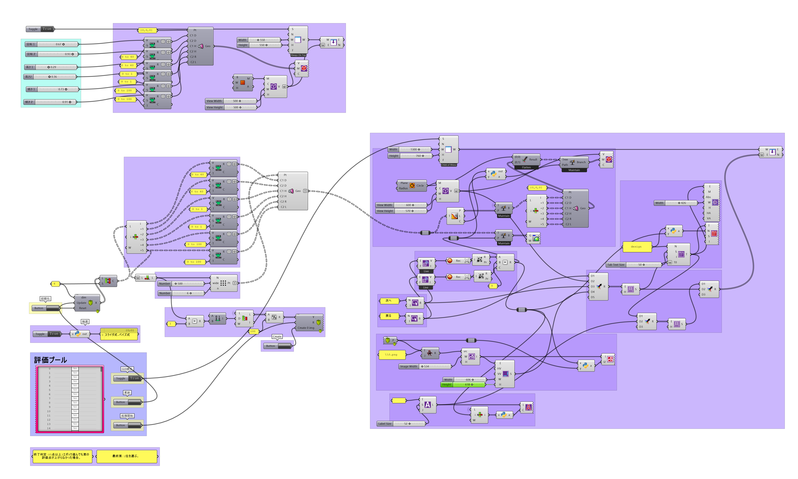
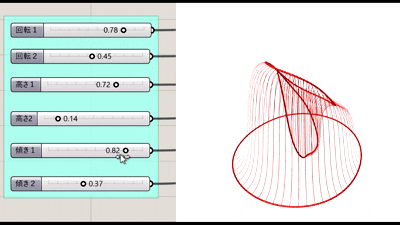

# Grasshopperで「好みのデザイン」を探す研究

---

## まず、Grasshopperとは？

Grasshopperは、3DモデリングソフトRhinocerosの上で動くビジュアルプログラミングツールです。
コードを書かなくても、ノードをつなぐだけで**パラメトリックデザイン**が作れます。

たとえば「高さ」「回転」「傾き」といったパラメータをスライダーで動かすだけで、形がリアルタイムに変わります。

---

## 無数の形が存在する

この研究では、6つのパラメータで定義されるパビリオンを題材にしました。

| パラメータ | 意味 |
|-----------|------|
| rotation1 / rotation2 | 回転 |
| height1 / height2 | 高さ |
| tilt1 / tilt2 | 傾き |

各パラメータは 0〜1 に正規化されており、その組み合わせは無数に存在します。

---

## スライダーの限界

Grasshopperのスライダーは直感的で便利ですが、こんな問題が起きるかもしれません。

- **中間値に偏りがち** — 極端な値（0や1に近い値）を試すのを無意識に避けてしまう
- **高次元で迷子になる** — パラメータが6個以上になると、探索しきれない組み合わせが増える
- **ローカル最適解に陥る** — 最初に気に入った形の近くをうろうろしてしまう

これは認知バイアスの影響です。「なんとなく触りやすい範囲」でデザインが固まってしまいます。

---

## AIが次の候補を提案してくれる仕組み

この研究では、**ベイズ最適化（Bayesian Optimization）** に着目し、
「ユーザーの主観評価」をもとにAIが次に試すべきパラメータを提案する仕組みを構築しました。

### 流れ

1. **最初に12案をAIが自動生成**（ソボル列サンプリング）
2. **ユーザーが0〜100点で評価**（美しさ・機能性・新規性などを総合した1スコア）
3. **AIが評価データを学習**し、好みの傾向をモデル化
4. **次に試す3案を提案**（探索と活用のバランスを自動調整）
5. 2〜4を繰り返す

<!-- TODO: Grasshopper上でのUIのスクリーンショット（評価プール・スライダー画面） -->

---

## 透明性の確保

「AIに操られている感」を減らすため、AIの思考プロセスをグラフで可視化しています。

- 各点 = これまでに評価したデザイン
- 色 = 評価スコア（高いほど明るい）
- 提案の方向性を **「探索寄り」「活用寄り」** とラベルで表示

---

## 実際のUI

左がスライダー操作、右がベイズ法のUIです。

ベイズ法では、評価プールから気に入ったデザインを選んで点数をつけるだけ。
次に何を試すかはAIが決めてくれます。

---

## 40人のユーザー実験で検証

参加者40名が両方の方法でデザインを作り、どちらが良かったかを比較しました。

| 評価項目 | ベイズ法支持率 | 統計的有意差 |
|---------|------------|-----------|
| 最終デザインの好み | 62.5% | あり |
| 全体的な満足度 | 62.5% | あり |
| デザインの多様性 | **85%** | あり（p<0.001） |
| 収束のしやすさ | 47.5% | なし |
| 使いやすさ | 40% | なし |

### スライダー法との探索範囲の違い

スライダー法では中間値に集中しているのに対し、ベイズ法では端の値（0や1付近）も積極的に探索されています。

---

## 実際に選ばれたデザインの例

ベイズ法を選んだ参加者（C・D）は、スライダー法とは大きく異なる形状のデザインにたどり着いています。
スライダー法で到達できなかった「潜在的な好み」を発見できた例といえます。

---

## まとめ

Grasshopperのスライダーでは、ごにょごにょするだけでは見つけられなかった好みの形状を、
ベイズ最適化によって、発見する手助けをするツールを作成しました。

そして実際に、スライダーで見つける好みの形よりも提案する方法の好みの形の方が満足度が高いと、証明できました。

この研究は、特に**「何が好きかまだよくわからない」段階**のデザイン探索に、
AIを自然に組み込む方法を示しました。

---

> 詳細は [論文](https://papers.cumincad.org/data/works/att/caadria2026_198.pdf) を参照してください。
